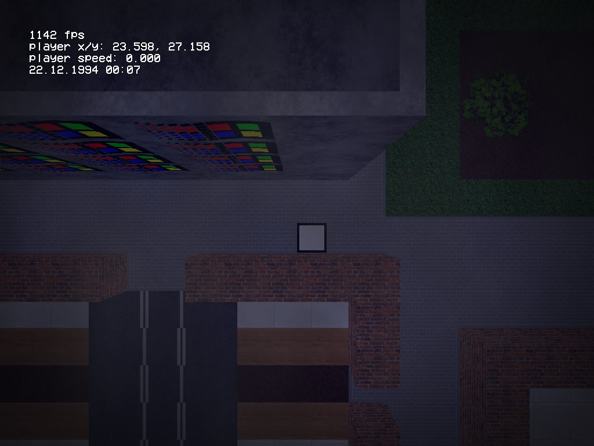
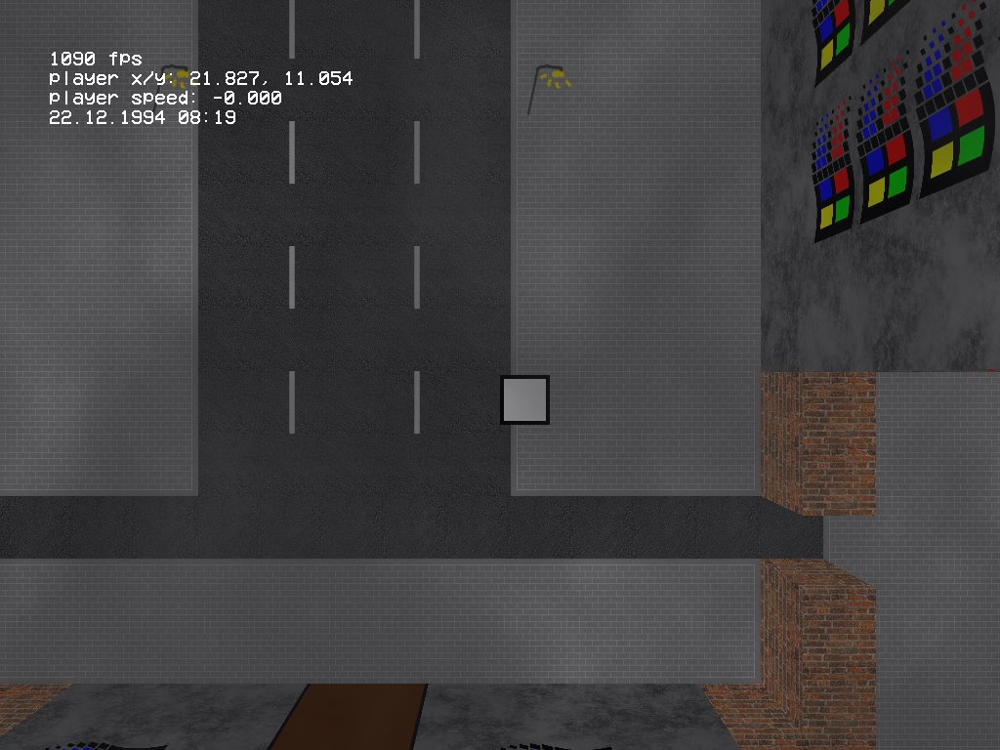
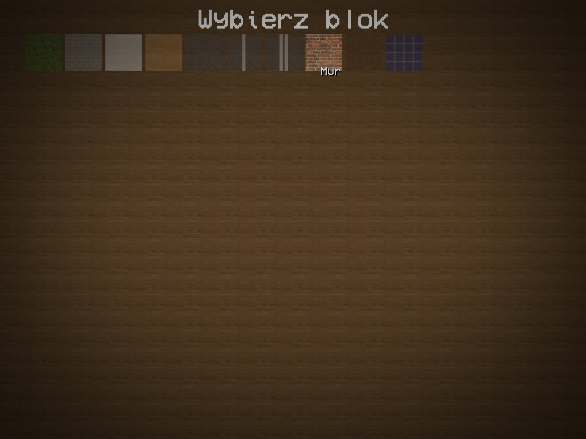
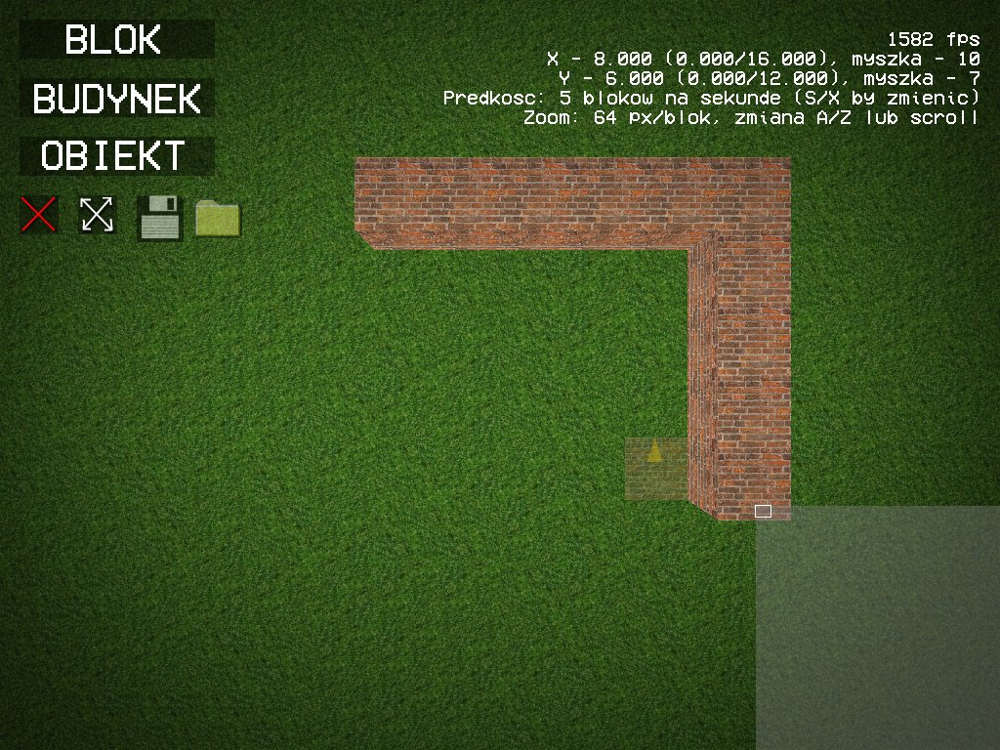

# unnamed-rpg

An ambitious game that I worked on as a 16-year-old, during the summer of 2016.
(Spoiler: it did not get anywhere; you can walk around the map, that's it)

## the bad storyline I had planned for the game
You are a YouTuber who just bought a DeLorean time machine replica for that
sweet pre-adpocalypse YouTube money. You then take it to a highway for a test
ride, which turns out to be a big mistake because surprise surprise, it's not
a replica, it's the actual real thing and you're now stuck in the Polish
village of Szenajda, and it is December 21, 1994. As you realize what just
happened, you start shaking in terror because you may now have to actually
contribute to society to make a living. Your first 10 days will be particularly
hard, as the money in your wallet (~300 PLN) is not in circulation yet, nor is
it legal tender until January 1, 1995.

Survive. Grind for money. Get a place. Buy yourself a VCR, a tape deck, maybe 
even a computer. Make new friends and try to stay away from those who want
to rip you off. Go to the store and buy yourself a 
[Turbo gum](https://en.wikipedia.org/wiki/Turbo_(chewing_gum)). 
Just make sure to not go out into the street at night.
Take in the bleak reality, but also the nostalgic atmosphere of mid-1990s
Poland. 

Will you try to return to 2016 at any cost or will you strike luck and find
a new, better life in the world you only know from your parents' and older
friends' stories? Find out soon and get the game when it releases in 2017!
:DDDD

# what is actually here
The above sure sounds very exciting, but this project was doomed to fail
because of lack of a clear direction for the technical design, my lack of
experience in programming and poor work discipline at the time. I had a set 
of loosely coupled ideas I thought would be really cool in a game (some of
which I described above), but my attempts to write a full script would also 
prove fruitless. The project was abandoned in late 2016.

If that wasn't all bad enough in itself, I kept the source code on a flash
drive that I formatted by accident in 2018 while trying to make a Linux live
USB on another flash drive I had plugged into my PC. All that survived to this
day are two .zip files with the game that I sent to a friend. One is from
2016-08-10 and contains the source code, the other one is from 2016-10-08
which shows the game almost beginning to take shape.

# the 2016-08-10 source code

The "game" consists of literally just a dot that you can move around a screen.
The map editor, however, is there, in pretty much the same form as the 
October build.

in general, this is not any better than you would expect a 16 year old's c++
code to look like :P I suggest not looking at the source code if you value
your own sanity. Some of the worse things about it:

 - Everything is in one compilation unit - there are no headers, I just 
 include all .cpp files from main.cpp
 - I clearly did not know what a "naming convention" was
 - I also did not know that ALLEGRO_CONFIG existed, so I wrote my own 
 bullet-proof class. So bullet-proof in fact, that it would crash whenever
  you tried to read from the last property in a file. I solved it by... 
  including a certain mean insult at the end of every configuration file 
  to support the bug.
 - Error messages contain profanity

# the 2016-10-08 build
The "game" part now actually loads a map made in the map editor and you can 
walk around the place. "Mine Valley Nights" from the Gothic OST is played as
placeholder background music.
A day/night cycle is implemented. The ~ key opens a
console and you can type "help" to get all available commands, of which there
are three (noclip, setspeed, postprocess). Maybe there are more undocumented
commands, I don't know since I don't have the source code anymore.

## Oct/Nov

In October or November, I got a simple inventory system working. Items could
be "used", which would execute a command (e.g. teleport the player to another
map). I believe that these late versions are lost forever now.

# screenshots

The project might not have become what I wanted, but it's still one of the 
coolest things I ever made :P

